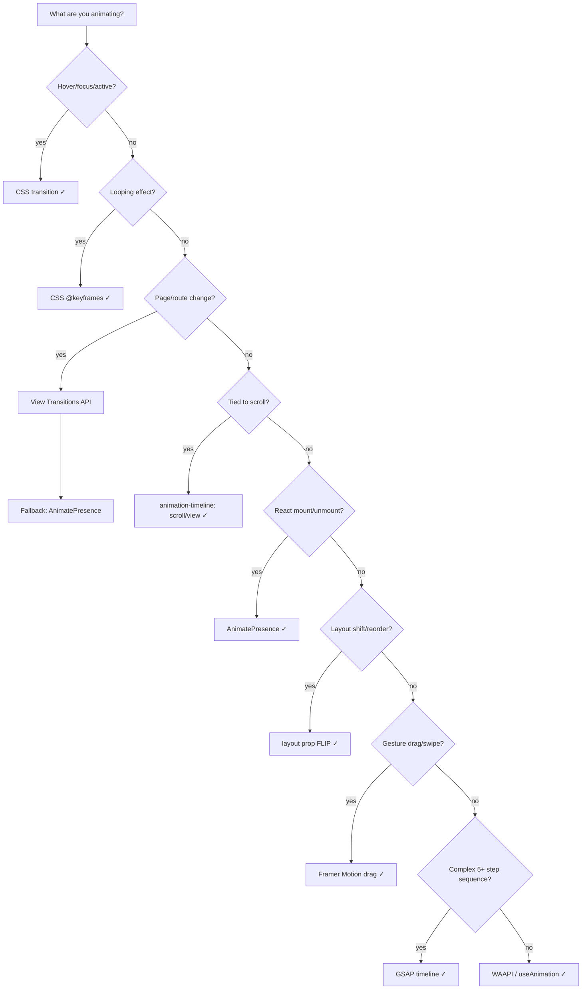

---
# Decision Tree — Web Animations

Standalone reference for picking the right animation technology.

## ASCII Flowchart

```
What are you animating?
│
├── Hover / focus / active state?
│   └── CSS transition  ← zero JS, GPU-composited, simplest
│
├── Looping effect (spinner, pulse, shimmer)?
│   └── CSS @keyframes  ← declarative, no runtime cost
│
├── Page or route transition?
│   └── View Transitions API  ← native browser, shared elements, Next.js support
│       └── Fallback: Framer Motion AnimatePresence + PageWrapper
│
├── Tied to scroll position?
│   └── CSS scroll-driven animations (animation-timeline)  ← compositor thread, 60fps
│       └── Fallback: Framer Motion useInView (once: true)
│
├── React component mount / unmount?
│   └── Framer Motion + AnimatePresence  ← only reliable unmount animation in React
│
├── Layout shift (reorder, resize, expand)?
│   └── Framer Motion layout prop (FLIP)  ← automatic, no position math needed
│
├── Gesture (drag, swipe, pinch)?
│   └── Framer Motion drag gestures  ← physics-based, touch-optimized
│
├── Complex orchestrated sequence?
│   └── Framer Motion variants + staggerChildren  ← declarative orchestration
│       └── Alternative: GSAP timeline (for very complex multi-step sequences)
│
└── Imperative / programmatic animation?
    └── Web Animations API (WAAPI) or Framer Motion useAnimation
```

## Visual Mermaid Flowchart



## Quick-Resolution Table

| Exact situation | Solution | Key API |
|-----------------|----------|---------|
| CSS `:hover`, `:focus`, `:active` | CSS `transition` | `transition: transform 150ms ease-out` |
| Spinning/pulsing/shimmer loop | CSS `@keyframes` | `animation: spin 0.7s linear infinite` |
| React `useState` toggle mount/unmount | `AnimatePresence` | `exit={{ opacity: 0 }}` |
| `<ul>` items enter one by one | `variants + staggerChildren` | `staggerChildren: 0.08` |
| SPA route change | View Transitions API | `startViewTransition()` |
| `window.scrollY` percentage | `animation-timeline: scroll()` | CSS only, compositor |
| Element enters viewport once | `animation-timeline: view()` | `animation-timeline: view()` |
| User drags a card | `drag="x"` | Framer Motion |
| Reorder list / accordion expand | `layout` + `AnimatePresence` | FLIP auto-calculated |
| Same element on two routes | `layoutId` | Shared element transition |
| Complex 5-step narrative intro | GSAP `timeline()` | `gsap.timeline()` |
| No library, imperative | WAAPI `element.animate()` | Native browser API |
| User drags horizontally | `drag="x"` in Framer Motion | Constrain axis with `dragConstraints` |
| User pinches to zoom | CSS `touch-action: pinch-zoom` + WAAPI or GSAP | Framer Motion drag ≠ pinch |
| Multi-touch rotation gesture | GSAP `Observer` or raw Pointer Events | CSS transition / Framer drag |
| Same component, different container sizes | CSS `@container` + `@keyframes` | Viewport breakpoints (`@media`) |

## Gesture Decision Subtree

```
User is interacting with touch/pointer
├── Single finger drag (reorder/dismiss)
│   ├── React → Framer Motion drag="x|y" + dragConstraints
│   └── Vanilla → Pointer Events + WAAPI translateX
├── Pinch to scale (zoom)
│   ├── CSS: touch-action: pinch-zoom (browser-native, no JS needed)
│   └── Custom: track distance between Touch[0] and Touch[1] → GSAP set()
└── Two-finger rotation
    ├── GSAP Observer plugin (cleanest API)
    └── Raw: PointerEvent angle math → element.style.transform
```

## Technology Comparison

| Technology | When to use | Avoid when |
|------------|-------------|------------|
| CSS transition | Hover, focus, active states | Mount/unmount, complex sequences |
| CSS @keyframes | Loops, multi-step on mount | React state-dependent |
| Framer Motion | React lifecycle, gestures, layout | Static HTML, no React |
| View Transitions | Page/route transitions | In-page element transitions |
| GSAP | Complex timelines, SVG morphing | Simple UI animations |
| WAAPI | No library, imperative control | When Framer Motion is available |
